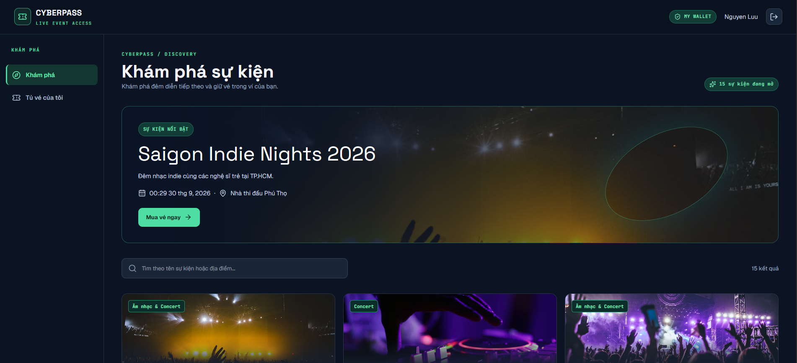
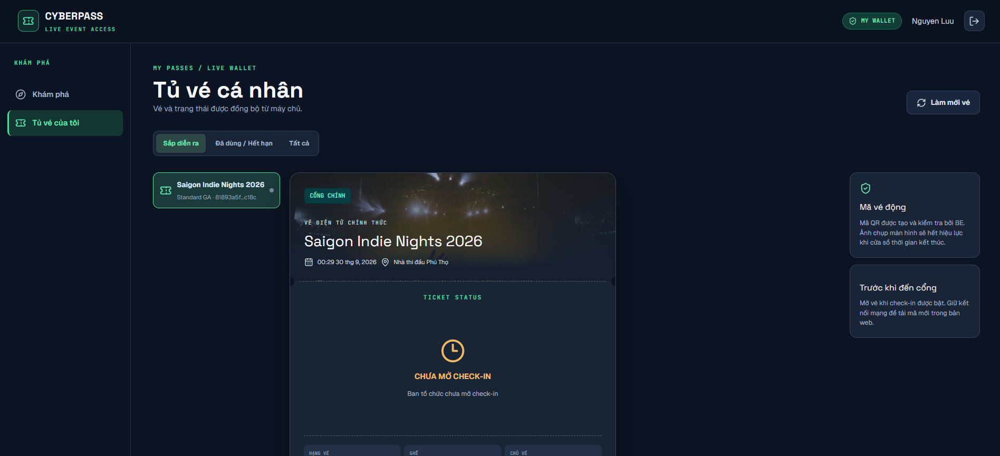
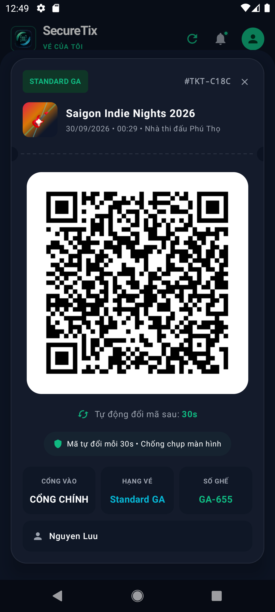
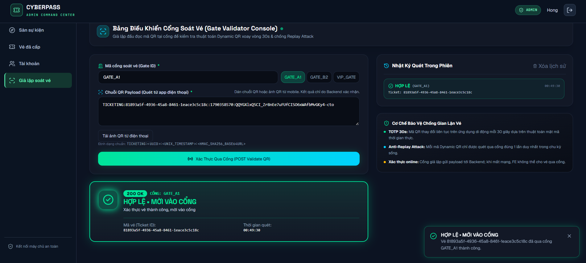
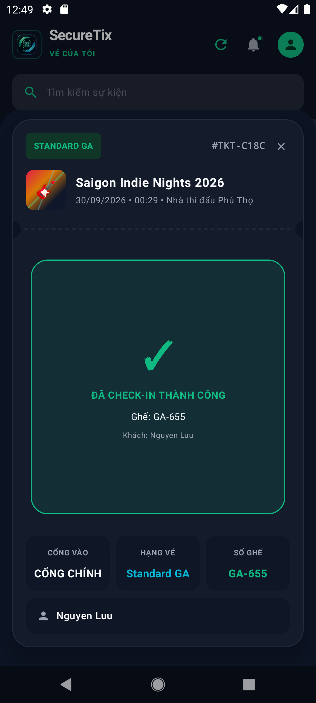
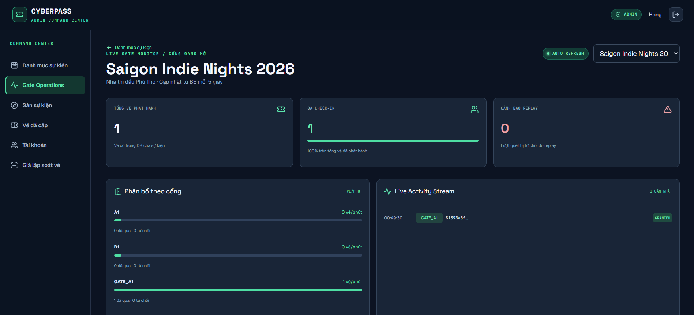
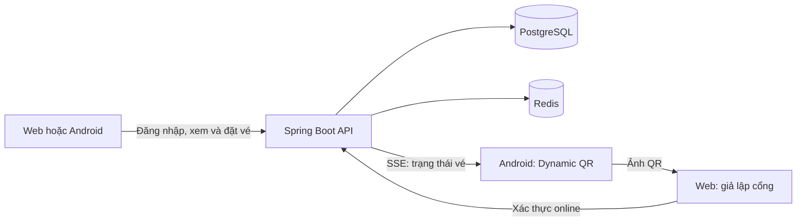

# Cyberpass — Dynamic QR Ticketing

Hệ thống quản lý sự kiện và vé điện tử gồm **web React**, **ứng dụng Android** và **backend Spring Boot**. Người dùng khám phá sự kiện, đặt vé và hiển thị QR thay đổi mỗi 30 giây. Ban tổ chức quản lý sự kiện, cấp vé, mở check-in và xác thực QR qua backend.

> Dự án đang ở giai đoạn prototype. Đặt vé hiện cấp vé trực tiếp, chưa có thanh toán. Trình quét web là công cụ giả lập cổng và cần kết nối backend để xác thực.

## Showcase

### Khám phá và đặt vé





### Dynamic QR trên Android



### Quét QR và cập nhật trạng thái vé

Trình giả lập cổng trên web gửi QR tới backend. Khi xác thực thành công, vé trên mobile chuyển sang trạng thái đã check-in.

| Kết quả ở web | Trạng thái trên mobile |
| --- | --- |
|  |  |

### Theo dõi cổng



Các ảnh trong `docs/showcase/` là ảnh chụp tĩnh. Khi có GIF cho luồng đặt vé hoặc QR xoay vòng, có thể thay ảnh tương ứng bằng GIF mà không cần đổi bố cục README.

## Chức năng

| Phần | Hiện có |
| --- | --- |
| Web người dùng | Đăng ký/đăng nhập, khám phá sự kiện, đặt 1–10 vé, xem tủ vé và QR lấy từ API |
| Web quản trị | Tạo/xuất bản sự kiện, cấp vé, mở check-in, dashboard cổng và giả lập quét QR |
| Android | Đăng nhập, đồng bộ vé, QR xoay vòng và cập nhật trạng thái qua SSE |
| Backend | Auth username/password với role, quản lý sự kiện/vé, xác thực QR và chống quét lại |



## Công nghệ và cấu trúc

- `backend/`: Java 21, Spring Boot 3.4, Spring Security, JPA, Flyway, Spring Modulith; PostgreSQL và Redis qua Docker Compose.
- `frontend/`: React 19, TypeScript, Vite, Tailwind CSS.
- `mobile/`: Kotlin, Jetpack Compose, OkHttp, C++/NDK cho QR động; có fallback HMAC khi native library không khả dụng.

## Chạy trên máy cá nhân

Cần **JDK 21**, **Node.js/npm** và **Docker Desktop**. Để build Android cần Android Studio, SDK, NDK và CMake theo cấu hình Gradle.

### 1. Database và Redis

```powershell
cd backend
docker compose up -d
docker compose ps
```

PostgreSQL: `localhost:5432`, database `ticketing_db`, user `ticketing_user`, password `ticketing_secret`. Adminer: <http://localhost:8081> (chọn PostgreSQL và nhập thông tin trên). Redis: `localhost:6379`.

### 2. Backend

Trong terminal khác:

```powershell
cd backend
.\gradlew.bat bootRun
```

API mặc định ở <http://localhost:8080/api/v1>; Swagger UI ở <http://localhost:8080/swagger-ui.html>. Flyway tự áp dụng migration trong `backend/src/main/resources/db/migration/` khi BE khởi động. Migration V13 thêm 12 event và 12 user demo nếu file đó có trong checkout.

### 3. Frontend

```powershell
cd frontend
npm ci
npm run dev
```

Mở địa chỉ Vite in ra terminal (thường là <http://localhost:5173>). FE mặc định gọi `http://localhost:8080/api/v1`. Nếu BE dùng địa chỉ khác, đặt `VITE_API_BASE_URL` thành URL đầy đủ có hậu tố `/api/v1` trước khi chạy Vite.

### 4. Android

Mở `mobile/` trong Android Studio và chạy module `app`. Android Emulator gọi BE trên máy host qua `http://10.0.2.2:8080/api/v1`. Với điện thoại thật, đặt server API theo IP LAN của máy chạy BE trong ứng dụng; hai thiết bị cần cùng mạng.

## Tài khoản demo và luồng check-in

Migration V13 tạo `demo01` đến `demo12`, cùng mật khẩu **`12345678`** và role `USER`. Đây là dữ liệu demo, không phù hợp cho production. Đăng ký trên web cũng tạo role `USER`; database sạch không có sẵn tài khoản ADMIN.

Để dùng phần quản trị trên DB local, đăng ký username `plozdev` ở web, rồi chạy trong Adminer:

```sql
UPDATE users
SET role_id = (SELECT id FROM roles WHERE name = 'ADMIN')
WHERE username = 'plozdev';
```

Đăng xuất và đăng nhập lại để phiên mới nhận role ADMIN. Nếu `plozdev` đã là ADMIN thì bỏ qua bước SQL.

1. Đăng nhập `demo01` trên web, đặt vé ở **Khám phá sự kiện** và mở **Tủ vé**. ADMIN cũng có thể cấp vé thủ công cho user.
2. ADMIN mở check-in cho sự kiện. Khi check-in chưa mở, vé không có QR để quét.
3. Đăng nhập cùng user trên Android, đồng bộ vé và mở popup QR khi còn mạng. Mobile cần BE xác nhận quyền mở check-in; sau khi popup đã mở và khóa vé đã được đồng bộ, luồng QR có thể tiếp tục xoay vòng khi mất mạng.
4. Trên web ADMIN, mở trình giả lập cổng, dán ảnh QR hoặc payload rồi gửi xác thực. Backend quyết định kết quả; quét lại vé đã dùng sẽ bị từ chối.
5. Xem trạng thái vé trên Android/web và số liệu trên dashboard cổng.

**Giới hạn hiện tại:** `Early Bird`, `Standard GA` và `VIP` dùng cùng `basePrice`; chưa có giỏ hàng/thanh toán. Web cần mạng để xác thực QR với BE. Mobile cần mạng để bắt đầu check-in hoặc làm mới thủ công; QR đang mở có thể tiếp tục xoay vòng từ khóa đã đồng bộ. API `sync-roster` cho thiết bị quét offline hiện trả danh sách rỗng. Dashboard lấy dữ liệu thật từ BE và làm mới định kỳ.

## API chính

| Endpoint (tiền tố `/api/v1`) | Quyền | Mục đích |
| --- | --- | --- |
| `POST /auth/signup`, `POST /auth/login` | Công khai | Tạo tài khoản hoặc nhận token |
| `GET /events` | Công khai | Danh sách sự kiện đã xuất bản |
| `POST /tickets/book` | User đăng nhập | Đặt vé cho chính mình |
| `GET /tickets`, `GET /tickets/{id}/dynamic-qr` | Chủ vé | Xem vé và lấy QR động |
| `GET /tickets/stream` | User đăng nhập | Cập nhật trạng thái vé qua SSE |
| `POST /tickets/issue`, `POST /events` | ADMIN | Cấp vé hoặc tạo sự kiện |
| `PUT /events/{id}/check-in` | ADMIN | Mở/đóng check-in |
| `POST /gates/{gateId}/validate` | ADMIN | Xác thực QR tại cổng |
| `GET /admin/events/{eventId}/gate-dashboard` | ADMIN | Số liệu và hoạt động cổng |

Các endpoint cần đăng nhập dùng header `Authorization: Bearer <token>`. Xem schema và API còn lại trong Swagger UI.

## Kiểm tra nhanh

```powershell
cd backend
.\gradlew.bat test

cd ..\frontend
npm run lint
npm run build
```

Android trên Windows: chạy `.\gradlew.bat :app:assembleDebug` trong `mobile/`.
