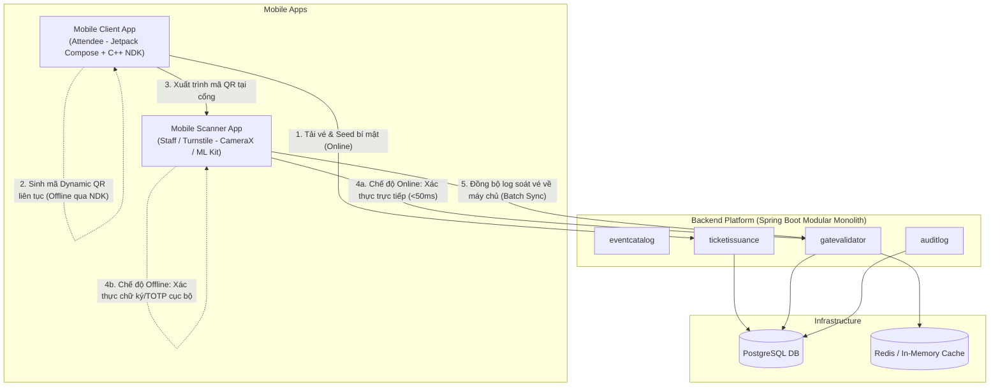

# TÀI LIỆU THIẾT KẾ KIẾN TRÚC TỔNG THỂ HỆ THỐNG DYNAMIC QR TICKETING
## (System-wide Technical Architecture & Engineering Blueprint)

---

## 1. TỔNG QUAN HỆ THỐNG (SYSTEM OVERVIEW)

### 1.1. Bối cảnh & Mục tiêu bài toán
Các giải pháp soát vé sự kiện truyền thống dựa trên mã tĩnh (Static QR) đối mặt với các lỗ hổng nghiêm trọng:
- **Chia sẻ trái phép**: Chụp ảnh màn hình, quay video mã QR gửi qua mạng xã hội cho nhiều người.
- **Đầu cơ chợ đen (Ticket Scalping)**: Sao chép vé bán cho nhiều nạn nhân; người đến cổng trước sẽ chiếm quyền vào cửa.
- **Tấn công lặp lại (Replay Attack)**: Sử dụng lại payload đã dùng trong cửa sổ thời gian hiệu lực.
- **Nghẽn cổng kiểm soát (Turnstile Bottleneck)**: Tình trạng sập mạng 4G/Wifi cục bộ tại sân vận động khiến máy quét không thể kết nối về máy chủ trung tâm, gây ùn tắc hàng ngàn khán giả.

### 1.2. Giải pháp cốt lõi: Dynamic QR & Client-side Cryptography
- **Sinh mã ngoại tuyến (Offline Client-side Generation)**: Sau khi tải dữ liệu vé về máy, ứng dụng di động tự sinh mã TOTP động hoàn toàn cục bộ (offline) bằng thuật toán mật mã học triển khai tại tầng Native (C++ qua NDK), không phụ thuộc kết nối mạng khi đứng trước cổng.
- **Cơ chế xoay mã (Rotating Dynamic QR)**: Mã QR tự động đổi mới sau mỗi $T$ giây (mặc định $T = 15s$ hoặc $30s$). Ảnh chụp màn hình sẽ mất hiệu lực ngay sau chu kỳ này.
- **Cửa sổ thời gian & Bù trừ lệch giờ (Clock Drift Tolerance)**: Cho phép chấp nhận độ lệch mạng $\pm 1$ bước thời gian (time window). Client đồng bộ độ lệch thời gian (Offset) với Server qua header HTTP chuẩn trong lần sync vé gần nhất.
- **Hỗ trợ soát vé ngoại tuyến (Zero-Network Validation Fallback)**: Thiết bị kiểm soát tại cổng (Scanner) có khả năng xác thực chữ ký mật mã học hoặc kiểm tra mã TOTP dựa trên danh sách dữ liệu cục bộ mà không cần gửi request về database trung tâm cho từng lượt quét.

---

## 2. KIẾN TRÚC TỔNG THỂ HỆ THỐNG (SYSTEM ARCHITECTURE)

Hệ thống được thiết kế theo mô hình Monorepo đồng nhất:

```text
dynamic-qr-ticketing/
├── backend/            # Spring Boot 3 (Modular Monolith)
├── mobile/             # Android Native (Kotlin + Jetpack Compose + C++ NDK)
├── docs/               # Tài liệu thiết kế kỹ thuật
│   ├── TECHNICAL_DESIGN.md   # Kiến trúc tổng thể hệ thống
│   ├── BACKEND_DESIGN.md     # Đặc tả chi tiết triển khai Backend
│   └── MOBILE_DESIGN.md      # Đặc tả chi tiết triển khai Mobile (Client & Scanner)
└── docker-compose.yml  # Hạ tầng cơ sở dữ liệu (PostgreSQL, Redis)
```

### 2.1. Sơ đồ tương tác toàn hệ thống (End-to-End System Context)



---

## 3. NGUYÊN LÝ MẬT MÃ HỌC & ĐỊNH DẠNG PAYLOAD (CRYPTOGRAPHY & PAYLOAD SPEC)

### 3.1. Các thành phần dữ liệu mật mã

- **`Ticket Seed` (Khóa đối xứng TOTP)**: Chuỗi ngẫu nhiên 256-bit tạo bằng `SecureRandom`, sinh ra khi phát hành vé và được mã hóa lưu trữ ở Server cũng như Client Keystore.
- **Cặp khóa bất đối xứng (Asymmetric Keypair - Ed25519 hoặc RSA-2048)**:
  - **Private Key**: Lưu an toàn tại Backend, dùng để ký số vào payload chứng thực vé khi xuất vé.
  - **Public Key**: Được nhúng sẵn vào ứng dụng Scanner hoặc tải về khi Scanner mở ca làm việc để kiểm tra tính toàn vẹn của vé mà không làm lộ khóa bí mật.

### 3.2. Định dạng Dynamic QR Payload

Chuỗi dữ liệu được encode vào mã QR có định dạng:

```text
TICKETING:<ticketId>:<expiresAtEpoch>:<dynamicToken>:<digitalSignature>
```

- **`ticketId`**: UUID của vé (ví dụ: `c3a4b920-f1c2-48a0-97f2-69f8c6e21012`).
- **`expiresAtEpoch`**: Thời điểm hết hạn của chu kỳ token hiện tại (Unix Timestamp tính bằng giây).
- **`dynamicToken`**: Mã băm HMAC-SHA256 (rút gọn về 6–8 chữ số hoặc chuỗi Base64Url) tính từ:

$$\text{dynamicToken} = \text{Truncate}(\text{HMAC-SHA256}(\text{Seed} + \text{Pepper}, \text{ticketId} + \text{TimeWindow}))$$

*(Trong đó: $\text{TimeWindow} = \lfloor\text{CurrentEpoch} / T\rfloor$)*.
- **`digitalSignature`**: Chữ ký số tạo bởi Private Key của Backend trên chuỗi `<ticketId>:<expiresAtEpoch>`.

---

## 4. GIAO THỨC TƯƠNG TÁC GIỮA MOBILE VÀ BACKEND (CLIENT-SERVER INTERACTION CONTRACT)

### 4.1. Luồng 1: Mua vé & Cấp phát vé (Device Binding & Key Provisioning)

1. **Thiết bị**: Gửi request `POST /api/v1/tickets/{id}/provision` kèm thông tin định danh phần cứng an toàn (`device_fingerprint`).
2. **Backend**:
   - Kiểm tra tính hợp lệ và quyền sở hữu vé.
   - Gán vé vào thiết bị (chống dùng chung trên nhiều điện thoại cùng lúc).
   - Trả về: Thông tin hiển thị vé, `Ticket Seed` (mã hóa qua kênh TLS), chữ ký số và Header HTTP `Date` (chuẩn thời gian Server để Client hiệu chỉnh lệch giờ).
3. **Thiết bị**: Lưu `Ticket Seed` vào **Android KeyStore** kết hợp **RoomDB** (Encrypted).

### 4.2. Luồng 2: Sinh mã Dynamic QR (Hoàn toàn Offline tại Client)

1. Timer trên Mobile kích hoạt chu kỳ cập nhật ($T = 15s$ hoặc $30s$).
2. Jetpack Compose ViewModel gọi hàm JNI xuống tầng C++ NDK.
3. Native module (C++) tính toán bù trừ độ lệch thời gian:
   $$\text{SyncedTime} = \text{LocalSystemTime} + \text{ClockOffset}$$
4. C++ thực thi hàm băm HMAC-SHA256 với `Ticket Seed` kết hợp hằng số bí mật (`INTERNAL_PEPPER`) giấu trong file `.so`.
5. Trả về chuỗi `dynamicToken` để Compose render lên giao diện qua Canvas/QRCode painter. Ứng dụng bật cờ `FLAG_SECURE` chặn chụp màn hình.

### 4.3. Luồng 3: Soát vé tại cổng (Gate Check-in Pipeline)

#### Nhánh Online (Độ trễ thấp, kết nối ổn định):
1. Máy quét (Scanner App) dùng CameraX / ML Kit giải mã chuỗi QR.
2. Gửi request `POST /api/v1/gates/{gateId}/validate` kèm payload QR.
3. **Backend**:
   - Kiểm tra Anti-Replay Cache (Redis / In-memory) với key `dynamicToken` (TTL = 60s). Nếu đã tồn tại $\rightarrow$ **TỪ CHỐI (DENIED_REPLAY)**.
   - Xác minh chữ ký số và mã HMAC trên cửa sổ $[-1, 0, +1]$.
   - Cập nhật trạng thái vé thành `USED` trong Database.
   - Ghi log kiểm toán và trả về kết quả `GRANTED` trong vòng dưới **50ms**.

#### Nhánh Offline Fallback (Mạng sân vận động bị sập):
1. Trước sự kiện, máy quét sync danh sách **Public Key** + **Danh sách vé hợp lệ / Vé bị hủy (Revocation List)** về bộ nhớ local (SQLite).
2. Khi quét mã lúc mất mạng:
   - Kiểm tra tính hợp lệ của chữ ký bằng Public Key cục bộ.
   - Tính toán và khớp mã TOTP trực tiếp trên máy quét.
   - Kiểm tra vé trong local SQLite xem đã đánh dấu qua cổng tại máy này chưa.
   - Lưu bản ghi check-in vào hàng đợi cục bộ (Local Outbox).
3. Khi có kết nối mạng trở lại: `WorkManager` trên Scanner App tự động đẩy toàn bộ log về API `POST /api/v1/gates/batch-sync` để ghi nhận và đối soát hậu kiểm (Reconciliation).

---

## 5. PHÂN CHIA TRÁCH NHIỆM CHO CÁC TÀI LIỆU THÀNH PHẦN

Nhằm đảm bảo sự tách bạch kiến trúc và chi tiết hóa mã nguồn, hai tài liệu tiếp theo sẽ phụ trách:

### 5.1. `BACKEND_DESIGN.md` (Spring Boot Modular Monolith)
- Thiết kế chi tiết 4 Bounded Contexts theo Spring Modulith: `eventcatalog`, `ticketissuance`, `gatevalidator`, `auditlog`.
- Mô hình Clean Architecture thu nhỏ trong từng module (Domain Ports, Application Services, Adapters).
- Kiến trúc cơ sở dữ liệu PostgreSQL (Flyway migrations, schema cách ly giữa các module).
- Cấu hình Anti-Replay Cache (Redis), In-Memory Domain Events, và cơ chế kiểm thử ranh giới kiến trúc (`ApplicationModules.verify()`).

### 5.2. `MOBILE_DESIGN.md` (Android Jetpack Compose + C++ NDK)
- Cấu trúc module ứng dụng theo Clean Architecture & MVI (Model-View-Intent).
- Tầng Native NDK/C++: Triển khai JNI, bảo vệ thuật toán HMAC-SHA256 và che giấu secret key trong file `.so`.
- Tầng Bảo mật Client: Quản lý khóa bằng Android KeyStore, mã hóa RoomDB, thiết lập `FLAG_SECURE`.
- Thiết kế App Khán giả (Hiển thị vé, vòng đếm ngược mượt mà, đồng bộ offset thời gian).
- Thiết kế App Máy quét (CameraX tối ưu tốc độ nhận diện frame, cơ chế soát vé Offline và hàng đợi đồng bộ dữ liệu nền `WorkManager`).